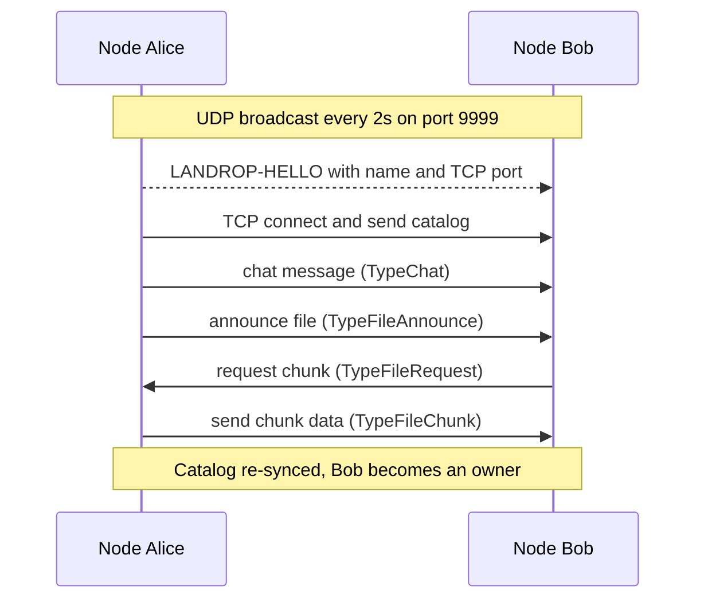

<div align="center">

# 📡 LANdrop

**Peer-to-peer messenger & file sharing for your LAN — no servers, no cloud, no limits.**


</div>

---

## 🚀 The Problem

Sharing large files between devices on the same network is painful:

- ☁️ Cloud uploads are **slow** and **rate-limited** — your 5 GB dataset crawls through an external server.
- 🔌 USB sticks and `scp` require manual setup, cables, and passwords.
- 🛰️ Ad-hoc servers (`python -m http.server`) are one-way, single-host, and die with the host.
- 🔐 Third-party services can see (and keep) your data.

**LANdrop** turns your local network into a self-organizing mesh. Every device is both a **client** and a **server**. Files are split into chunks and shared in parallel across all peers — the more peers, the faster the transfer. No internet, no accounts, no central point of failure. Perfect for **hackathons, LAN parties, and engineering teams**.

---

## ✨ Features

- 📡 **Zero-config discovery** — peers find each other automatically over UDP broadcast (no IPs to type).
- 💬 **Instant LAN chat** — multicast a message to every active peer.
- 🧩 **Mini-torrent file sharing** — files are split into **64 KB chunks** and downloaded from multiple owners **in parallel**.
- 🗂️ **Distributed file catalog** — every peer knows what's in the network and who has it, kept in sync automatically.
- 🧑‍🤝‍🧑 **Graceful peer churn** — nodes leaving the network are pruned and their files removed from the catalog.
- 📦 **Truly portable** — one static binary per platform. Runs on macOS, Linux, Windows, and even **Android (Termux)**.

---

## 📦 Requirements

- **Go 1.25+** to build from source.
- A network that supports **UDP broadcast** (typical for LANs / Wi-Fi with AP-isolation off).

> No Go installed? Grab a pre-built binary from the [Releases](https://github.com/your-org/landrop/releases) page.

---

## ⚡ Quick Start

### Build from source

```bash
git clone https://github.com/Rodef228/landrop.git
cd landrop

# macOS / Linux
go build -o landrop ./cmd/node/

# Windows
go build -o landrop.exe ./cmd/node/
```

### Run it

```bash
# Machine A
./landrop -name alice

# Machine B (same network)
./landrop -name bob
```

That's it — Alice and Bob see each other automatically and can start chatting.

### Transfer a file

```text
# On Alice:
/announce ./presentation.pdf          # announce a file to the network
/announce ./video.mp4 my_video_id     # or give it a friendly ID

# On Bob:
/files                                # see what's available
[SYSTEM]: Known files (1):
  - presentation.pdf (ID: a1b2c3, size: 524288 bytes, chunks: 8, owners: 1)
      [alice] has 8 chunk(s)

/download a1b2c3                      # grab it — chunks stream in parallel
```

---

## 🎮 CLI Reference

### Flags

| Flag          | Description                                      | Default                        |
|---------------|--------------------------------------------------|--------------------------------|
| `-name`       | Your nickname in the network                     | `node-{hostname}-{pid}`        |
| `-port`       | TCP port for peer connections                    | `0` (OS-assigned dynamic port) |
| `-storage`    | Directory for shared file chunks                 | `./storage`                    |

Environment variables `NODE_NAME`, `NODE_PORT`, and `NODE_STORAGE` are also supported.

### Commands

| Command                       | Description                                                        |
|-------------------------------|--------------------------------------------------------------------|
| *(type any text)*             | Send a chat message to all active peers                            |
| `/announce <path> [id]`       | Split a file into chunks and share it with the network             |
| `/download <file_id>`         | Download a file, pulling chunks in parallel from its owners        |
| `/files`                      | Show the distributed catalog of all known files and their owners   |

---

## 🧠 How It Works



1. **Discovery** — each node sends a UDP broadcast (`LANDROP-HELLO:{name}:{tcp_port}`) every 2 seconds on port `9999`. `SO_REUSEADDR` lets multiple nodes run on one machine.
2. **Transport** — all data (chat, chunks) travels over TCP on an OS-assigned port that's announced via broadcast.
3. **File storage (CDN)** — files are split into 64 KB chunks stored in `./storage/`. Peers request only the chunks they need from whoever owns them.
4. **Distributed catalog** — every peer keeps an in-memory map of all known files and chunk owners. New peers get a full snapshot; changes are broadcast to everyone.
5. **Churn** — a peer that stops responding for 30+ seconds is removed, and its files are pruned from every catalog.

> ⚠️ **Name collisions:** two nodes with the same `-name` will conflict. The second node exits with an error — just restart it with a different name.

---

## 📁 Project Structure

```
cmd/node/                   — entry point, CLI, message handling
internal/discovery/         — peer discovery (UDP broadcast + registry)
internal/network/           — TCP server for data transport
internal/protocol/          — message types & encoding
internal/cdn/               — chunked file storage (the "mini-torrent")
internal/catalog/           — distributed in-memory file catalog
internal/helpers/           — encoding, filesystem & network utilities
internal/types/             — shared domain types
```

---

## 🧪 Development

```bash
# Run all tests
go test ./...

# Vet
go vet ./...

# Cross-compile for other platforms
CGO_ENABLED=0 GOOS=darwin  GOARCH=arm64 go build -ldflags="-s -w" -o landrop ./cmd/node/
```

> **CI builds:** prebuilt binaries for macOS, Linux and Windows are produced automatically by the [GitHub Actions release workflow](.github/workflows/release.yml) when a version tag (e.g. `v0.1.0`) is pushed.

> See [`CONTRIBUTING`](.github/CONTRIBUTING.md) — coming soon. Issues and feature requests are tracked via [GitHub Issues](https://github.com/your-org/landrop/issues).

---

## 🗺️ Roadmap

- [ ] **v0.2.0** — Automatic rebuild of partial downloads & resumable transfers
- [ ] **v0.3.0** — End-to-end encryption & peer authentication
- [ ] **v0.4.0** — NAT traversal / relay fallback for non-broadcast networks
- [ ] **v0.5.0** — TUI and/or web dashboard UI
- [ ] **Future** — Folder syncing, multi-interface networking, IPv6

---

## 🤝 Contributing

Contributions are what make the open-source community great! Any changes are welcome:

1. Fork the repo
2. Create your feature branch (`git checkout -b feat/awesome-thing`)
3. Commit your changes (`git commit -m 'Add awesome thing'`)
4. Push & open a PR

Please use the provided [issue templates](.github/ISSUE_TEMPLATE/) and [PR template](.github/PULL_REQUEST_TEMPLATE.md).

---

## 📄 License

Distributed under the **MIT License**. See [`LICENSE`](LICENSE) for more information.

---

<details>
<summary><b>🇷🇺 Русская версия</b></summary>

# 📡 LANdrop

**P2P-мессенджер и обмен файлами в локальной сети — без серверов, без облаков, без ограничений.**

## Проблема

Обмен большими файлами между устройствами в одной сети — это боль:

- Облака медленные и с лимитами: 5 ГБ качаются через внешний сервер вечность.
- Флешки и `scp` требуют ручной настройки, кабелей и паролей.
- Временные сервера (`python -m http.server`) односторонние и умирают вместе с хостом.
- Сторонние сервисы видят и хранят ваши данные.

**LANdrop** превращает локальную сеть в самоорганизующуюся mesh-сеть. Каждое устройство — одновременно и клиент, и сервер. Файлы режутся на чанки и качаются параллельно у всех пиров: чем больше устройств — тем быстрее. Без интернета, аккаунтов и единой точки отказа. Идеально для **хакатонов, LAN-вечеринок и команд**.

## Возможности

- 📡 **Автообнаружение** — пиры находят друг друга по UDP-broadcast, IP вводить не нужно.
- 💬 **Мгновенный чат** — сообщение уходит сразу всем активным пирам.
- 🧩 **Mini-torrent** — файлы режутся на чанки по **64 КБ** и качаются с нескольких владельцев **параллельно**.
- 🗂️ **Распределённый каталог** — каждый пир знает, какие файлы есть в сети и у кого.
- 🧑‍🤝‍🧑 **Устойчивость к уходу пиров** — ушедшие узлы вычищаются из сети.
- 📦 **Полностью портативно** — один статический бинарник под каждую платформу: macOS, Linux, Windows и даже **Android (Termux)**.

## Быстрый старт

```bash
git clone https://github.com/your-org/landrop.git
cd landrop
go build -o landrop ./cmd/node/

./landrop -name alice   # машина A
./landrop -name bob     # машина B (в той же сети)
```

```text
/announce ./presentation.pdf     # раздать файл
/files                           # посмотреть каталог
/download a1b2c3                 # скачать файл
```

## Флаги

| Флаг       | Описание                                     | По умолчанию                  |
|------------|----------------------------------------------|-------------------------------|
| `-name`    | Имя узла в сети                              | `node-{hostname}-{pid}`       |
| `-port`    | TCP-порт для соединений                      | `0` (динамический, от ОС)     |
| `-storage` | Каталог для хранения чанков файлов           | `./storage`                   |

## Команды

| Команда                  | Описание                                                     |
|--------------------------|--------------------------------------------------------------|
| *(любой текст)*          | Отправить чат-сообщение всем активным пирам                  |
| `/announce <путь> [id]`  | Разрезать файл на чанки и раздать его по сети                |
| `/download <file_id>`    | Скачать файл, параллельно запрашивая чанки у владельцев      |
| `/files`                 | Показать распределённый каталог всех известных файлов        |

## Лицензия

Распространяется по лицензии **MIT** (см. [`LICENSE`](LICENSE)).

</details>
